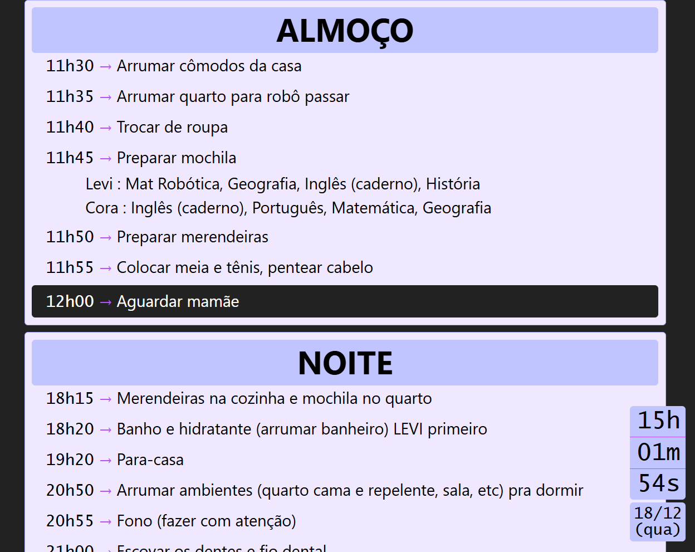

# Rotinas dos filhos
Substitua o "faça isso" ou "faça aquilo" a todo instante. Uau! Imagina? Sim! Aqui em casa foi possível. Desenvolvi uma ultra básica página de rotinas, que a Alexa manda abrir automaticamente na TV da sala. Desta forma agora nossa fala é "rotina ok?". Isso ajudou demais a organizar as rotinas e trouxe segurança de que tudo o que precisava ser feito estava de fato sendo feito.

## Tecnologias usadas
- HTML
- Javascript
- CSS
- Jquery
- JSON

## Para rodar
1. Clone o projeto
2. Inicie um servidor web qualquer
3. Acesse o seu servidor web